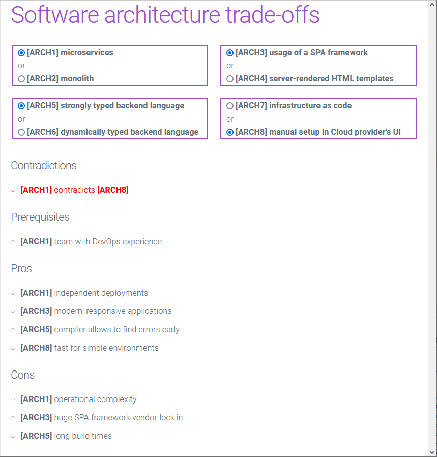
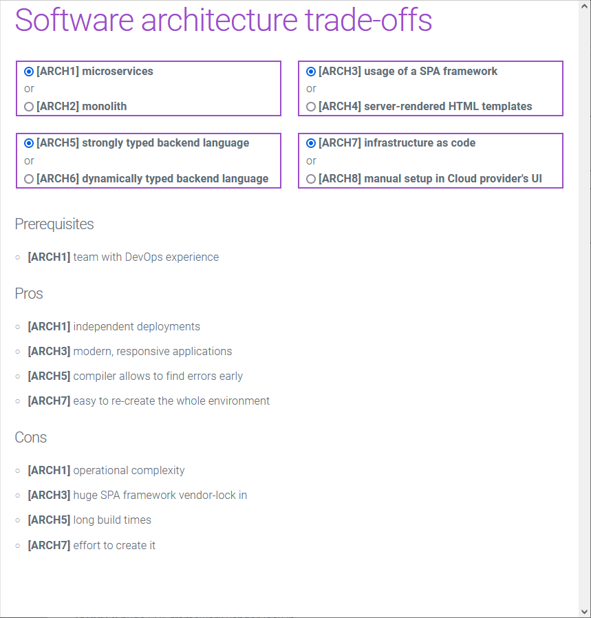

# agony-of-choice

Life in general (and software architecture in special ;-)) is full of trade-offs.
This tool helps to see a summary of all pros and cons summarized.
The basic idea is to reduce the problem space to binary decisions that focus on a single concern.
Some of the options might be mutually exclusive.
In addition to pros and cons also prerequisites can be modeled.

A simple text format is used:

```
# comments start with '#'
[ARCH8] manual setup in Cloud provider's UI
-- prerequisites
-- contradicts: {[ARCH1]}
-- pros
--- fast for simple environments
-- cons
--- prone to error for example when creating a new stage
--- {[ARCH3]} is a con that is only included if option [ARCH3] is selected as well
```

Two consecutive options are always interpreted as a choice.

## Software architecture example

This is the built-in example that is contained in the embedded `choices.txt`.
An alternative (external) file can be set with a `agony-of-choice.choices-file-location=file:c:/my-choices.txt` argument.

In the first example contradicting options were selected.


Where as in the second example no contradictions are there.


## Tech stack

Goal of the tech stack was to be as minimal as possible:

-   Java 17
-   Spring Boot
-   Thymeleaf for templating
-   [Milligram](https://milligram.io/) as CSS framework
-   [htmx](https://htmx.org/) for interactivity (not a single line of JavaScript was written... ;-))
